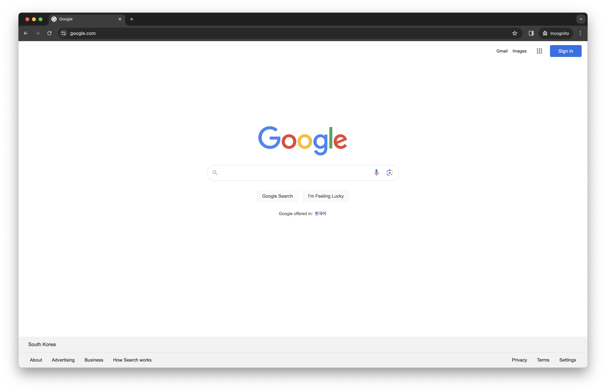
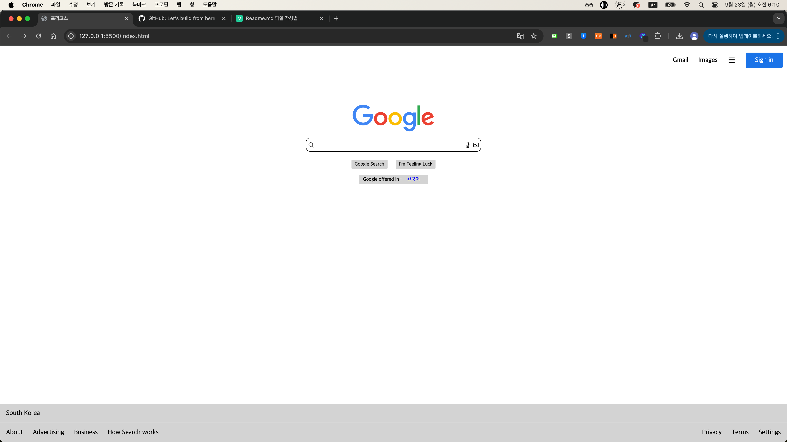

# 구글 프로젝트

## 구글 프로젝트 미리보기



## 주요 개념

- HTML의 적용
- 시맨틱 마크업
- Block, Inline, Inline-Block 요소의 차이점
- CSS 문법과 적용
- CSS 선택자
- 웹 페이지 마크업 구조 설계 방법
- CSS로 가운데 정렬하는 방법
- CSS 포지션을 활용한 레이아아웃 설계 방법
- CSS 박스 모델
- CSS 플렉스 박스

## 설치 방법

1. 터미널 실행
2. git clone https://github.com/hxxhyun/google-clone 명령어 입력
3. index.html 실행 or Live server 응용프로그램 통해서 실행

### 1. Header(Nav)

- html

  ```html
  <header>
    <a>Gmail</a>
    <a>Images</a>
    <a></a>
    <a class="sign-in">Sign in</a>
  </header>
  ```

- css

  ```css
  header {
    text-align: right;
  }

  a {
    margin: 10px;
  }

  a img {
    position: relative;
    top: 5px;
    width: 20px;
  }

  .sign-in {
    background-color: #1a73e8;
    color: white;
    padding: 9px 23px;
    border-radius: 4px;
  }

  header {
    margin-top: 20px;
  }
  ```

### 2. Main

- html

  ```html
  <div class="logo-box">
    
  </div>

  <div class="input-box">
    <div class="input">
      <input type="text" />
      
      
      
    </div>
  </div>

  <div class="search">
    <a class="button">Google Search</a>
    <a class="button">I'm Feeling Luck</a>
  </div>

  <div class="offer">
    <p>
      Google offered in :
      <a>한국어</a>
    </p>
  </div>
  ```

- css

  ```css
  .logo-box {
    text-align: center;
    margin-top: 100px;
  }

  .logo-box img {
    width: 200px;
  }

  .input-box {
    text-align: center;
    margin: 10px 0 10px 0;
  }

  .input input {
    width: 400px;
    height: 30px;
    padding-left: 23px;
    border-radius: 10px;
    border: 1px solid black;
  }

  .input {
    position: relative;
    display: inline-block;
  }

  .search-icon {
    position: absolute;
    left: 5px;
    width: 15px;
    height: 15px;
    margin-top: 10px;
  }

  .mic-icon {
    position: absolute;
    right: 25px;
    width: 15px;
    height: 15px;
    margin-top: 10px;
  }

  .picture-icon {
    position: absolute;
    right: 5px;
    width: 15px;
    height: 15px;
    margin-top: 10px;
  }

  .search {
    display: flex;
    justify-content: center;
  }

  .button {
    padding: 5px 8px;
    background-color: lightgray;
    font-size: 12px;
    border-radius: 2px;
  }

  .offer {
    display: flex;
    justify-content: center;
    margin: 5px;
  }

  .offer p {
    padding: 5px 10px;
    background-color: lightgray;
    font-size: 12px;
    border-radius: 2px;
  }

  .offer a {
    color: blue;
  }
  ```

### 3. Footer

- html

  ```html
  <footer>
    <div class="location">South Korea</div>
    <div class="etc">
      <ul class="ul-1">
        <li>About</li>
        <li>Advertising</li>
        <li>Business</li>
        <li>How Search works</li>
      </ul>

      <ul class="ul-2">
        <li>Privacy</li>
        <li>Terms</li>
        <li>Settings</li>
      </ul>
    </div>
  </footer>
  ```

- css

  ```css
  footer {
    width: 100%;
    position: absolute;
    bottom: 0;
    display: flex;
    flex-direction: column;
    background-color: lightgray;
  }

  footer div {
    padding: 15px 15px;
  }

  .location {
    border-bottom: 1px solid black;
  }

  .etc {
    display: flex;
    justify-content: space-between;
  }

  .etc .ul-1 > li {
    display: inline;
    margin-right: 20px;
  }

  .etc .ul-2 > li {
    display: inline;
    margin-left: 20px;
  }
  ```

### 전체코드

- html

  ```html
  <!DOCTYPE html>
  <html lang="en">
    <head>
      <meta charset="UTF-8" />
      <meta name="viewport" content="width=device-width, initial-scale=1.0" />
      <title>프리코스</title>
      <link rel="stylesheet" href="reset.css" />
      <link rel="stylesheet" href="style.css" />
    </head>
    <body>
      <header>
        <a>Gmail</a>
        <a>Images</a>
        <a></a>
        <a class="sign-in">Sign in</a>
      </header>

      <div class="logo-box">
        
      </div>

      <div class="input-box">
        <div class="input">
          <input type="text" />
          
          
          
        </div>
      </div>

      <div class="search">
        <a class="button">Google Search</a>
        <a class="button">I'm Feeling Luck</a>
      </div>

      <div class="offer">
        <p>
          Google offered in :
          <a>한국어</a>
        </p>
      </div>

      <footer>
        <div class="location">South Korea</div>
        <div class="etc">
          <ul class="ul-1">
            <li>About</li>
            <li>Advertising</li>
            <li>Business</li>
            <li>How Search works</li>
          </ul>

          <ul class="ul-2">
            <li>Privacy</li>
            <li>Terms</li>
            <li>Settings</li>
          </ul>
        </div>
      </footer>
    </body>
  </html>
  ```

- css

  ```css
  header {
    text-align: right;
  }

  a {
    margin: 10px;
  }

  a img {
    position: relative;
    top: 5px;
    width: 20px;
  }

  .sign-in {
    background-color: #1a73e8;
    color: white;
    padding: 9px 23px;
    border-radius: 4px;
  }

  header {
    margin-top: 20px;
  }

  .logo-box {
    text-align: center;
    margin-top: 100px;
  }

  .logo-box img {
    width: 200px;
  }

  .input-box {
    text-align: center;
    margin: 10px 0 10px 0;
  }

  .input input {
    width: 400px;
    height: 30px;
    padding-left: 23px;
    border-radius: 10px;
    border: 1px solid black;
  }

  .input {
    position: relative;
    display: inline-block;
  }

  .search-icon {
    position: absolute;
    left: 5px;
    width: 15px;
    height: 15px;
    margin-top: 10px;
  }

  .mic-icon {
    position: absolute;
    right: 25px;
    width: 15px;
    height: 15px;
    margin-top: 10px;
  }

  .picture-icon {
    position: absolute;
    right: 5px;
    width: 15px;
    height: 15px;
    margin-top: 10px;
  }

  .search {
    display: flex;
    justify-content: center;
  }

  .button {
    padding: 5px 8px;
    background-color: lightgray;
    font-size: 12px;
    border-radius: 2px;
  }

  .offer {
    display: flex;
    justify-content: center;
    margin: 5px;
  }

  .offer p {
    padding: 5px 10px;
    background-color: lightgray;
    font-size: 12px;
    border-radius: 2px;
  }

  .offer a {
    color: blue;
  }

  footer {
    width: 100%;
    position: absolute;
    bottom: 0;
    display: flex;
    flex-direction: column;
    background-color: lightgray;
  }

  footer div {
    padding: 15px 15px;
  }

  .location {
    border-bottom: 1px solid black;
  }

  .etc {
    display: flex;
    justify-content: space-between;
  }

  .etc .ul-1 > li {
    display: inline;
    margin-right: 20px;
  }

  .etc .ul-2 > li {
    display: inline;
    margin-left: 20px;
  }
  ```

## 결과 화면


